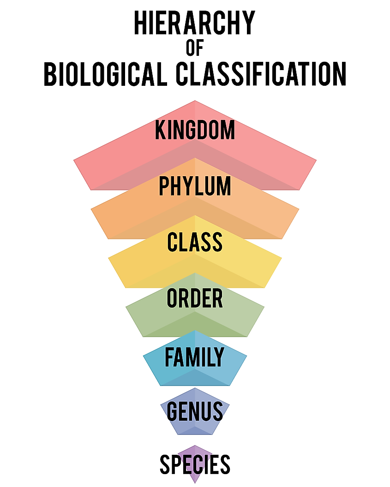

# Simplified Repository For Strategies and Parameters

## Description

I wanted to create a place to store and share strategy parameters for each of our various strategies in the systematic bucket. This will also be a repo and database to store various strategies that we are working on or backtesting either at the moment, or have worked with in the past.

## Naming convention

Unfortunately we haven't come up with a strong naming convention yet for our various strategies. My thought is to work with a heirarchy, similar to something like the  
The entire system is part of the `ALPHA PREDATOR` system. That I suppose is the `Kingdom.`
We might further breakdown the strategies into: (and I'm spitballing here):

- Systematic Strategies
  - Momentum
    - eg. Stochastics
    - Moving Average crosses, etc.
  - Mean Reversion
    - RSI, etc.
  - Complex
    - Strategies where multiple different system classes are combined. Example would be a trend following system that has mean reversion components based on an indicator which would try to identify regime shifts. For example, when in a choppy market it switches from trend following to mean reversion.
  - Black Box
    - ML Alpha would be a good example of this.
  - Fundamental
    - For lack of a better word. This category would be heavily dependent on outside factors and features, eg.
      - blockchain transaction and activity data
      - social media followers and mentions
      - github forks, commits, stars, etc.
      - other developer activity

## Problem

Strategies have been developed over the years in various different code bases and need to be consolidated.

We should seek to store in a simplified repo or database table at a minimum, the

- Name
  - Short name
  - Long name
  - Internal Ticker (primary key)
- Description
  - Short description for human readable material
  - Longer form description for outsiders (think factsheets and other marketing material if outward facing)
  - Technical description for internal eyes
  - High level description of the strategy base class. eg. `stochastic family of momentum systems`.
- Link to github repo if available
- Link to external facing index web page
- Underlying asset(s)
- Strategy parameters
  - short description of each parameter
  - value of each parameter
  
## Database Schema

For now I am assuming we will have two or three tables

- A `strategy_master` for descriptions and other relevant items
- A `strategy_detail` table for individual strategy items like parameters, underlying assets, backtest-start and end, forwardtest start and end, go-live date, etc
- A `strategy_series` for all of our various strategies and time series. Basically a table of time series data where each strategy is tickerized can be pulled by the researcher to look at the returns, etc.
- A `strategy_constituents` this is a table of the holdings in each strategy. We may build this table like compustat did where there is a `From` and `Thru` date to compress the database as much as possible. eg. if Bitcoin is in 20 different strategies, you wouldn't have to include every day, minute, second, you would simply be able to query for a given strategy `ticker` which would be the primary key, you could pull all of the constituents `where ticker = queryticker and querydate isbetween from and thru`
- I can't really think of any more tables now but more might come up.

I'm not going to build the database at this time. We can start with simple markdown files with links.
[strategy-list](strategy-list.md)